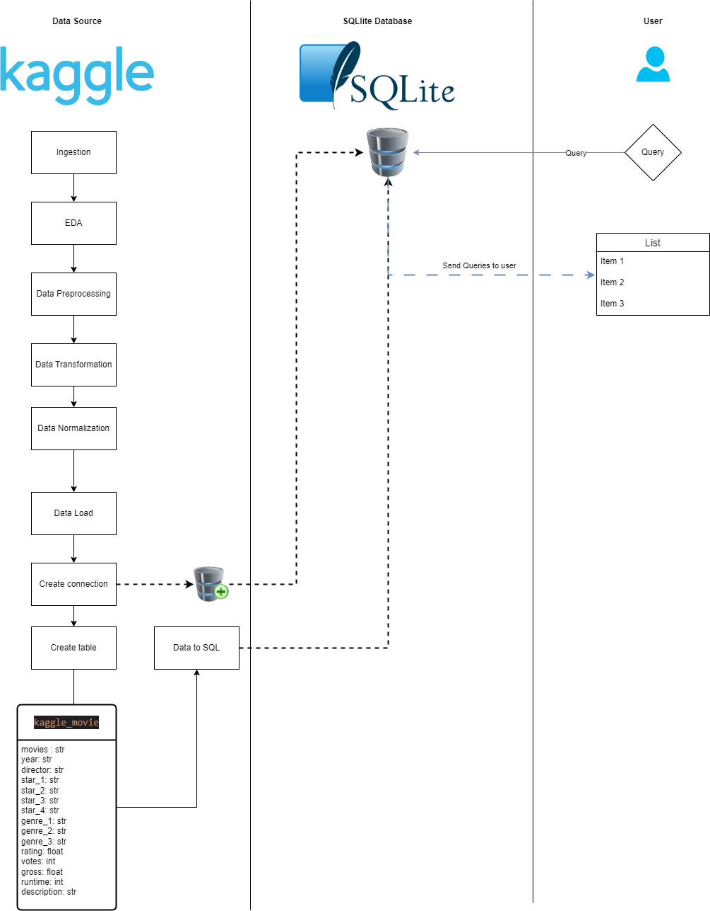

# EDA-to-SQL
This repository is the showcase for my personal project section on my CV

This project is all about the EDA to SQL

it's started from I downloaded a Kaggle data set to gave my intern a task to try to clean the data, and while doing that I also did mine too.

But, after that, I think it would be nice If I could push the step further to just done cleansing and just hold it on a shelf, so I extract and load into a table for SQL using SQLlite3 database libraries to store it on local storage, and then I give someone access the data and let them have the experience to query the data using SQL language.

